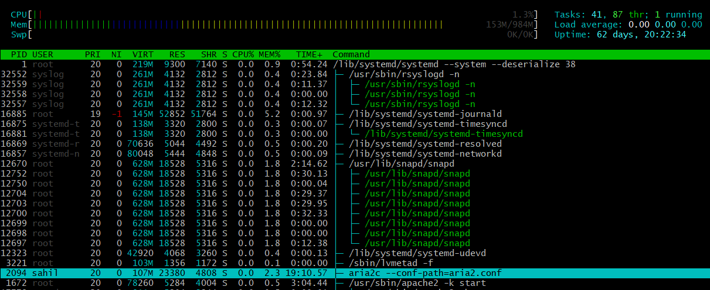
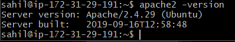
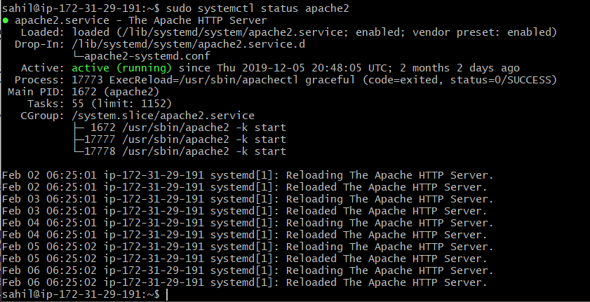
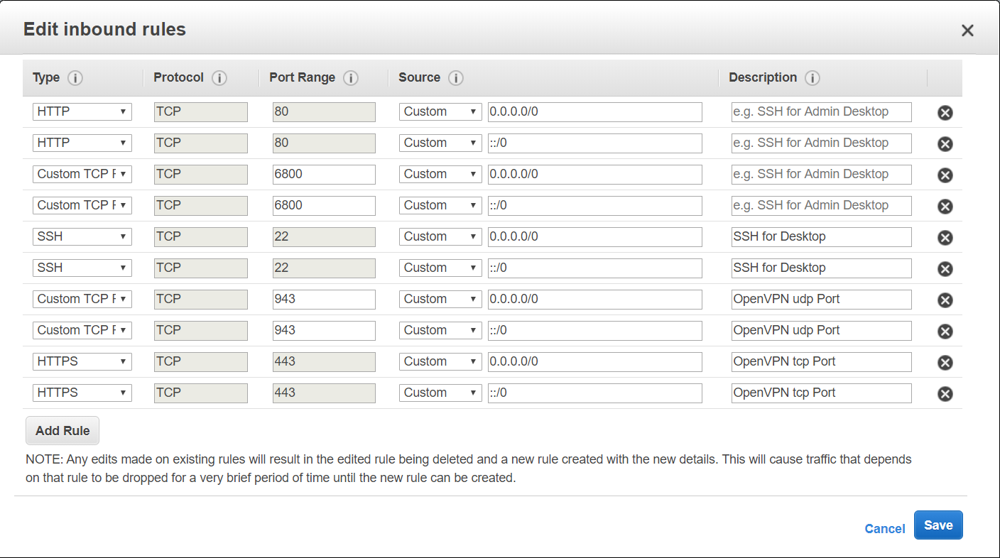
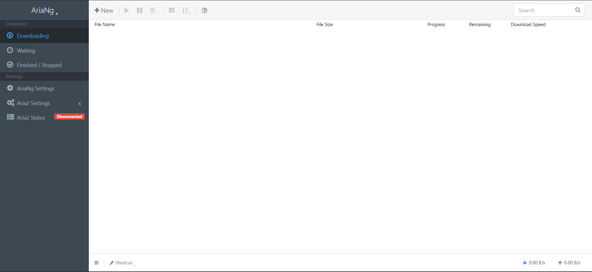
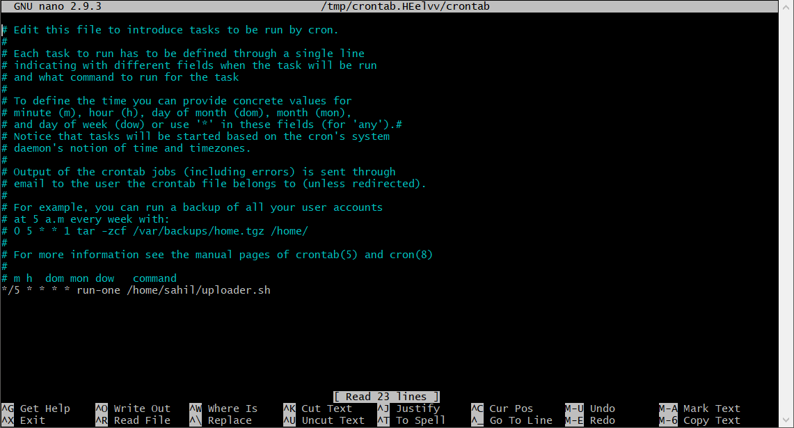
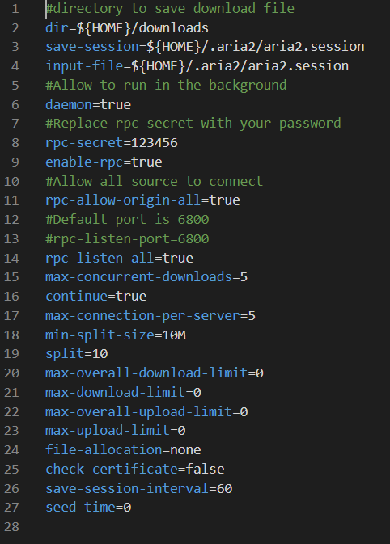

# aria2_for_aws

## Description

This project uses an instance based on aws(amazon web services) ec-2 to download files on via **[aria2](https://github.com/aria2/aria2)**(command-line download utility) and uploading them using rclone to your personal google drive account for easy access. Front end is handled by **[AriaNG](https://github.com/mayswind/AriaNg)**. This runs off a linux based server and has a bash script running on a cronjob that checks when the downloads are complete and then starts to upload them, eliminating the need for manual intervention. Once the download is complete the script then deletes the file from the server.

---

### Perquisites
* Knowing your way around a command-line.(MUST! XD)
* An ec2 instance on aws with the following configuration(1-vCPU, 1-gig RAM and 30GB of storage).
This configuration is eligible for free tier for 1 year. There are various guides on the internet that show how to set up an instance.*
* A public IP(elastic IP) to connect to your system and ssh/putty connection to login into the server.
* Knowledge of opening various ports to your instance via security groups.

## Table of Contents:
1. SSHing into and setting up the server.
2. Installing aria2c and setting up *aria2.conf* file.
3. Setting up *rclone* to upload files to personal google drive.
4. Writing a shell script to upload files when download completes automatically.
5. Installing *apache2 server* to host front-end webpage.
6. Setting up RPC token key and load testing.
7. Automating the whole process.

----

## Installation

### *Step 1:* SSH-ing into your server

-Use your preferred ssh client to connect to your server. If you have set a new server this might be using a private *.pem* file or you can enable *passwordauthentication* to *yes* and use any terminal to ssh on port 22.

    $ ssh username@your-ip -p 22

-update the packages on your instance.

    $ sudo apt update
    $ sudo apt upgrade
    
### *Step 2:* Installing aria2

-Now we will install aria2 on the server. Since it is a ubuntu machine we will be covering only ubuntu here.

    $ sudo apt-get install aria2
    
-Provide sudo password if asked and wait for the install to finish.

aria2 requires a configuration file to run. You can use my config file provided below.

    $ cd ~
    $ wget https://github.com/SahilKr24/aria2aws/blob/master/aria2.conf
    
We need to set the session file for aria2 to save sessions into so we'll create that

    $ mkdir ${HOME}/.aria2/
    $ touch ${HOME}/.aria2/aria2.session
   
We need to start aria2 now so execute the command below with the path of the *conf* file.

    $ aria2c --conf-path={aria2 configuration file} -D
    
    //assuming the file is in home disrectory
    
    $ aria2c --conf-path=aria2.conf -D
    
    //-D starts aria2 in background
    
We can now 

    $ htop
    
and see if aria2 is running. 

-We have successfully installed aria2.

### *Step 3:* Setting up rclone

To install rclone run:

        $ curl https://rclone.org/install.sh | sudo bash
        
Once rclone is installed we need to set it up for google drive.
Here is the link for the official documentation for setting up rync with google drive.

[official documnetation](https://rclone.org/drive/)

>but I suggest to follow this quick and efficient guide on *medium*

[config rclone for your google drive](https://medium.com/@houlahop/rclone-how-to-copy-files-from-a-servers-filesystem-to-google-drive-aaf21c615c5d)

> **please remember to give the name `googledrive` for our remote name for now.**

Once rclone is set up we will create a folder called *downlaoads* in our home directory where aria2 will be storing the downloaded files. You can name the folder whatever you want but then the *aria2.conf* will have to be modified which we will see later.

Now that rclone is set up, we will proceed to the fun part that is writing a shell script to upload files to drive from the *downloads* folder.

### *Step 4:* Writing the shell script

Well, we already have a shell script on the repository so go ahead and fetch that 

        $ cd ~
        $ wget https://github.com/SahilKr24/aria2aws/blob/master/uploader.sh
        $ chmod +x uploader.sh
        
The script is very simple. It works on the concept that when aria2 is downloading files an *.aria2* sesssion file is placed in the folder where the file is being downloaded i.e. in our case the *downloads* folder. The script checks the number of files having an *aria2.conf*, if the number is 0 ,it concludes that no files are being downloaded on the moment and runs the commands for rclone.

This was necessary because we are going to run our script every 5 minutues automatically, if we don't check for the incomplete downloads then the files being downloaded will be pushed to the google drive which is undesirable behavior. In cases where the download is paused, the *.aria2* file will stay preventing *rclone* from uploading them. When a download fails, the *.aria2* file is deleted automatically along with the partically downloaded data.

We are using the `move` command for *rclone* since we have limited space on our server and don't want to cache files on it. One key advantage it has over *gdrive* is that if you modify the folder from google drive web i.e. delete a file on the cloud the sync won't break as in cases with sync if the destination doesn't match with the local directory records the sync wont happen.

To execute the script just run 

    $ bash uploader.sh
    
Since there are no downloaded files right now so the script wont do anything.

### *Step 5:* Installing apache2 server to host the front-end server

Run the following command to install Apache2:

    $ sudo apt install apache2
    
then check if the install was successful

    $ apache2 -version
    

    
Once the installation is verified, we need to add firewall exceptions. So run the following commands:

    $ sudo ufw allow 'Apache'
    
Now we can check if the server is running or not.

    $ sudo systemctl status apache2
    
We should get an output of something like this:

> You need to edit the `security groups` and open `port 80 (tcp)` for the instance to listen for incoming connection on aws console.
> Since we are accessing the console now, we might as well open a couple of other ports so that *aria2* can listen on it's default port and communicate with it's front-end client.

You can now enter the public ip of your server in a browser and you will be greeted with a default apache install page.

Once, this is done we will now install `AriaNG` which is a front-end client for aria2. Huge thanks to @mayswind for the repository.

Check out the repository at [AriaNG](https://github.com/mayswind/AriaNg)

To install AriaNG run the following code in order:

    $ sudo apt-get install nginx
    $ cd ~
    $ wget https://github.com/mayswind/AriaNg/releases/download/1.1.4/AriaNg-1.1.4.zip
    $ sudo unzip AriaNg-1.1.4.zip -d /var/www/html/aria2
    
Since the files are being extracted to */var/www/html/aria2* folder, so to access the webpage you need to go to

    http://server-ip/aria2 
    
Check if the following page works. If it does you will be greeted with this page.

### *Step 6:*  Setting up RPC token key and load testing.

Notice on the left side the tab *Aria2 Status* says disconnected. This is because we need to enter the `rpc-secret` token present in the *aria2.conf* into

>AriaNg Settings->RPC({server-ip})->Aria2 RPC Secret Token

It's set to `123456` by default and we must change it after the setup.

Aria2 Status will show “Connected” if the token is correct.

Congrats your front-end GUI, aria2 and server is now set up.

Throw some files to download using the `+` icon on the left.

### *Step 7:*  Automating the whole process.

This is the crucial part of the installation. Upto this point your server can download files and upload them but the point in between where you have to run the *uploader.sh* script is still manual.

To avoid this problem we will be taking help of *cronjob*. Cronjob allows up to schedule a certain task at a certain interval without user intervention. Setting up a *cronjob* is a bit tricky so follow the steps carefully.

    $ cd ~
    $ crontab -e
    
default editor should pop up to edit the crontab file. Assuming its nano, insert the following line at the end of the file.

> */5 * * * * run-one /home/sahil/uploader.sh

#### Note that relative directory ${HOME} will NOT work here, so you need to replace *sahil* by the username you have set up on your machine. 

Your file should look like this.

Press CTRL + O to write changes to the file.
Press CTRL + X  to exit and return to terminal.

*/5 indicates that the script will be excuted every 5 minutues. We will not be going into the technical details of cronjob at this moment.

We are using `run-one` so that there are never more than one copy of the script running at a instant. This is to ensure that if a file takes more than 5 mins to upload, there won't be another srcipt excecuted that starts uploading the same file(s).

#### CONGRATULATIONS. You have successfully built a download server based on aws.

## Usage:

---

Now that we have successfully set up our server, we should now change the `rpc-sercet` key to something other than 123456 to prevent unauthorised access. To do that, we need to edit the our *aria2.conf* file.

    $ cd ~
    $ sudo nano aria2.conf
    
You should see nano pop up with the following values.

Find the *rpc-token* data and change it from default to whatever key you want.

Remember to update the `Aria2 RPC Secret Token` on our front-end.

Here you will also find a lot of values which can be used to change the behaviour of aria2. You can read about it in the aria2 documentation.

Remember to keep the `seed-time = 0` so that when torrent files are finished downloading the *.aria2* file will be removed else if the torrent is seeding it's assumed as a download in progress. So the uploader script will not acknowledge that the file has been downloaded.

Now, we have set up all the required values for aria2, you can use your download server.

>AWS provides 15GB of outgoing data i.e. from server to google drive in a calender month so keep the limit in mind failing which if might result in *additional charges*.

## Demo
Please visit [http://3.1.95.63/aria2](http://3.1.95.63/aria2)

## License:
[MIT](https://github.com/SahilKr24/aria2aws/blob/master/LICENSE)
